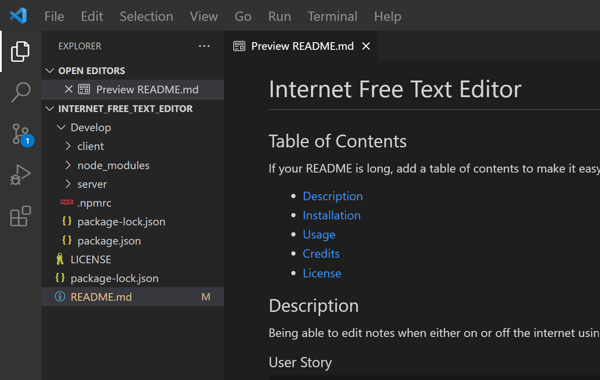
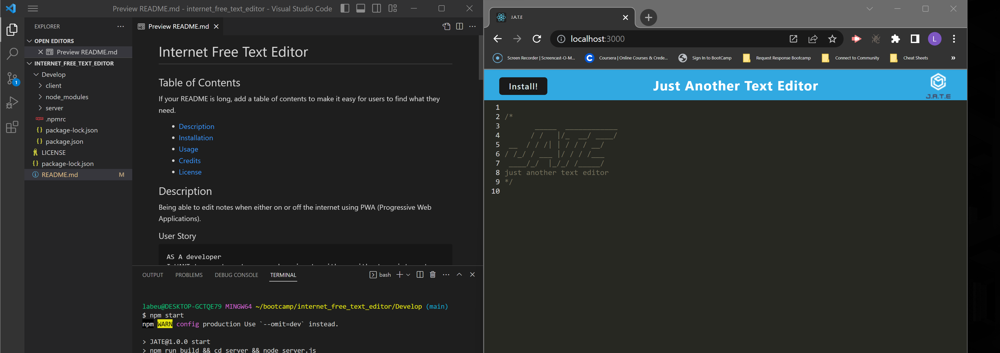
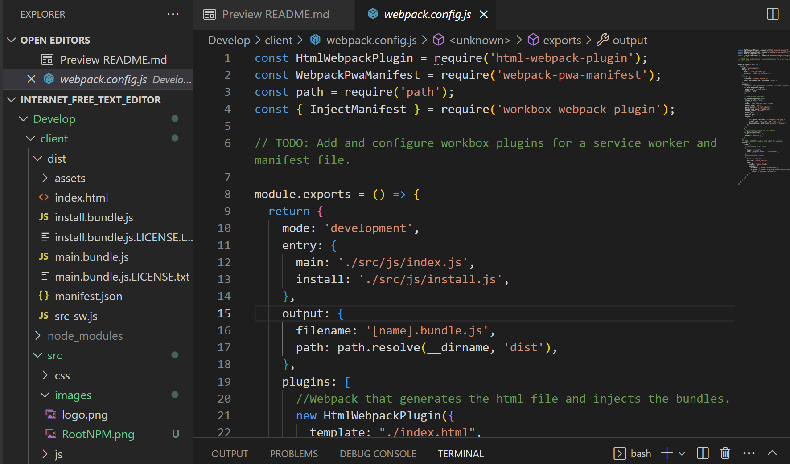
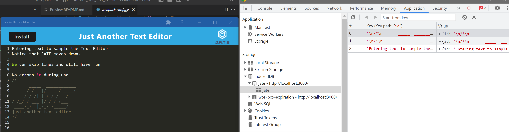
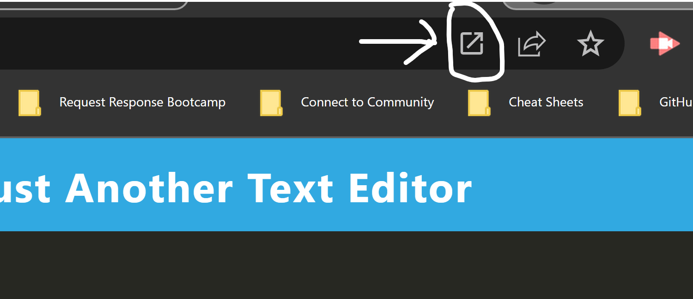

# Internet Free Text Editor

## Table of Contents

If your README is long, add a table of contents to make it easy for users to find what they need.
- [Description](#description)
- [Installation](#installation)
- [Usage](#usage)
- [Credits](#credits)
- [License](#license)

## Description
Being able to edit notes when either on or off the internet using PWA (Progressive Web Applications).

### User Story

```md
AS A developer
I WANT to create notes or code snippets with or without an internet connection
SO THAT I can reliably retrieve them for later use
```

### Acceptance Criteria

```md
GIVEN a text editor web application

WHEN I open my application in my editor
THEN I should see a client server folder structure

WHEN I run `npm run start` from the root directory
THEN I find that my application should start up the backend and serve the client

WHEN I run the text editor application from my terminal
THEN I find that my JavaScript files have been bundled using webpack

WHEN I run my webpack plugins
THEN I find that I have a generated HTML file, service worker, and a manifest file

WHEN I use next-gen JavaScript in my application
THEN I find that the text editor still functions in the browser without errors

WHEN I open the text editor
THEN I find that IndexedDB has immediately created a database storage

WHEN I enter content and subsequently click off of the DOM window
THEN I find that the content in the text editor has been saved with IndexedDB

WHEN I reopen the text editor after closing it
THEN I find that the content in the text editor has been retrieved from our IndexedDB

WHEN I click on the Install button
THEN I download my web application as an icon on my desktop

WHEN I load my web application
THEN I should have a registered service worker using workbox

WHEN I register a service worker
THEN I should have my static assets pre cached upon loading along with subsequent pages and static assets

WHEN I deploy to Heroku
THEN I should have proper build scripts for a webpack application
```

## Installation

You can click on the link and be able to open JATE, the Just Another Text Editor.<br>
Please click [here]().

## Usage

### You will be able to open the terminal and see the Client Server folder structure.





### From there, when typing into the terminal 'npm run start', the application will start up.





### In this image, you can see that there are bundles along the left of the image.  You will also see that there is an HTML file, service worker file and a manifest file.  





### You are able to use the text editor without errors with while using the next-gen Javascript.
### As well as IndexedDB has immediately created a database storage when entering data into JATE.





### You will also be able to close out of JATE and your information will be saved, thanks to setting up the indexedDB.
### When clicking on Install, you will download JATE directly to your computer, then all you will need to do is click on the following ICON in order for the app to present.





## Credits

[Webpack Help](https://www.npmjs.com/package/webpack-pwa-manifest)

[Babel Help](https://webpack.js.org/loaders/babel-loader/)

[Cache Help](https://medium.com/animall-engineering/best-caching-strategies-progressive-web-app-pwa-c610d65b2009)

## License

[MIT License](https://choosealicense.com/licenses/mit/)
---